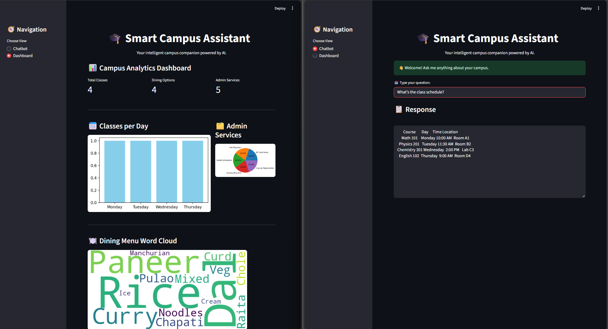

# 🎓 Smart Campus Assistant

## Overview
Your intelligent campus companion powered by AI. This chatbot helps students access campus-related information instantly—class schedules, library hours, dining menus, and administrative procedures.

## Features
- 🧠 Natural language query support  
- 📚 CSV-powered campus data  
- 💬 Clean, chat-style UI inspired by Perplexity  
- ✅ Error handling and fallback responses

## Screenshot


> Split-screen view showing campus analytics and chatbot response. Includes metrics, visualizations, and AI-powered dining info. 

## How to Run
```bash
pip install streamlit pandas
streamlit run app.py
```

